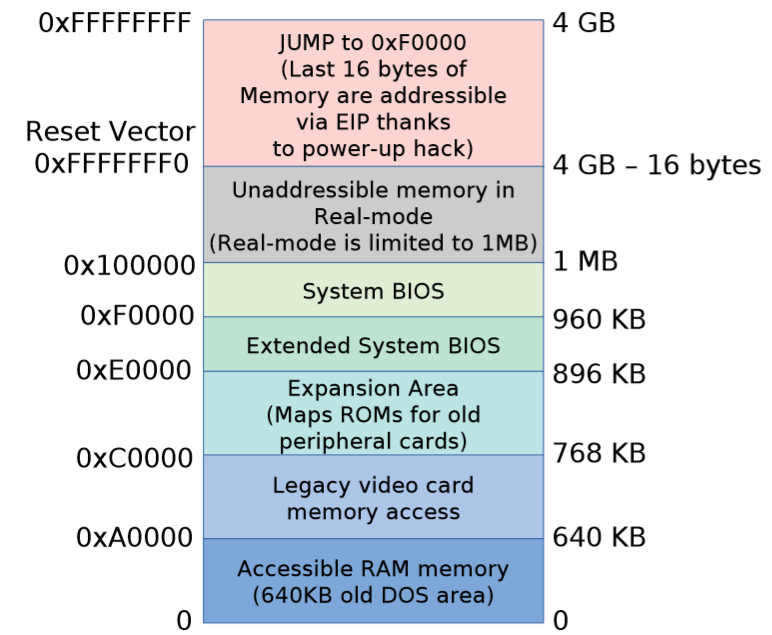

# Section 1 --- Background

- 第1章 计算机系统概述 
    1. 操作系统及其启动过程 操作系统及其启动过程
    2. 计算机基本构成 Basic Elements
    3. 微处理器的发展 Evolution of the Microprocessor
    4. 基本指令周期 Basic Instruction Cycle
    5. 引入中断机制后的指令周期 Instruction Cycle with Interrupts

## 第一章 计算机系统概述

### 操作系统及其启动过程

操作系统（Operating System，简称OS）是管理和控制计算机硬件与软件资源的计算机程序，是直接运行在“裸机”上的最基本的系统软件，任何其他软件都必须在操作系统的支持下才能运行。

**简单的启动过程概述：**
我们都知道程序的执行是必须要进去内存之后进行执行，操作系统也可以看作一个程序的运行，如果从开机加载到内存中执行的过程就是系统的启动。 

在计算机开机时，boot被自动执行，指引CPU把操作系统从大容量存储器（外存）中传送到主存储器的易失区（内存）。一旦操作系统放到了主存储器中，boot要求CPU执行一条转移指令，转到这个存储区域，在这个时候，操作系统接管并且开始控制整个机器的活动。

**更为详细的启动过程Booting Procedure描述（待更）：**

1. An IA–32-based computer is expected to have a **BIOS** (Basic Input/Output System, which comprises the bootloader firmware) in **non-volatile memory, typically ROM**.
    - BIOS is firmware used to perform **hardware initialization** during the booting process (power-on startup), and to provide runtime services for operating systems and programs.
    - The BIOS is a descendent of the BIOS found on early CP/M systems in that it contains low-level functions for accessing some **basic system devices**, such as performing disk I/O, reading from the keyboard, and accessing the video display. It also contains code to load a **stage 1 boot loader**.

2. When the **CPU** is reset at startup, the computer starts execution at memory location **0xFFFF0** (the IA–32 architecture uses a segment: offset form of addressing; the code segment is set to 0xF000 and the instruction pointer is set to 0xFFF0) **(CS : IP=0xF000:0xFFF0)**.

3. The processor starts up in **real mode**, which gives it access to only a **20-bit memory address space** and provides it with direct access to I/O, interrupts, and memory.
    - **The location at 0xFFFF0 is actually at the end of the BIOS ROM and contains a jump instruction to a region of the BIOS that contains start-up code.**
    - 注意，这时候BIOS已经装入内存了，CPU指向内存的0xFFFF0,也就是如图System BIOS这个区域，这里装着一条跳转指令，跳到BIOS程序的入口点。因为有的BIOS的程序大小不一样，所以有Extended System BIOS这个区域。

4.	Upon start-up, the BIOS goes through the following sequence:

    1. Power-on self-test (POST). 上电自检。
    2. Detect the video card’s (chip’s) BIOS and execute its code to initialize the video hardware.
    3. Detect any other device BIOSes and invoke their initialize functions.
    4. Display the BIOS start-up screen.
    5. **Perform a brief memory test (identify how much memory is in the system). 内存检测。**
    6. Set memory and drive parameters.
    7. Configure Plug & Play devices (traditionally PCI bus devices).
    8. Assign resources (DMA channels & IRQs).
    9. Identify the boot device.

5. When the BIOS identifies the boot device (typically one of several disks that has been tagged as the bootable disk), it reads **block 0** from that device into memory location **0x7c00** and jumps there.

**Stage 1: Master Boot Record**

This first disk block, block 0, is called the **Master Boot Record (MBR)** and contains the first stage boot loader. Since the standard block size is 512 bytes, the entire boot loader has to fit into this space. The contents of the MBR are:
- First stage boot loader (≤ 446 bytes)
- Disk partition table, which identifies distinct regions of the disk (16 bytes per partition × 4 partitions = 64 bytes)
- Disk signature (2 bytes) 0x55AA

**Stage 2: Volume Boot Record**

Once the BIOS **transfers control to the start of the MBR that was loaded into memory**, the MBR code scans through its partition table and loads the Volume Boot Record (VBR) for that partition. The VBR is a sequence of consecutive blocks starting at the first disk block of the designated partition. The first block of the VBR identifies the partition type and size and contains an Initial Program Loader (IPL), which is code that will load the additional blocks that comprise the second stage boot loader. On Windows NT-derived systems (e.g., Windows Server 2012, Windows 8), the IPL loads a program called NTLDR, **which then loads the operating system**.

