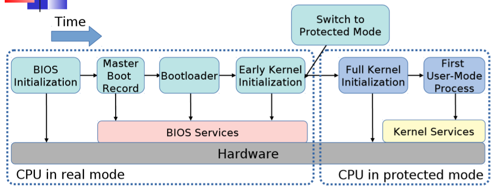
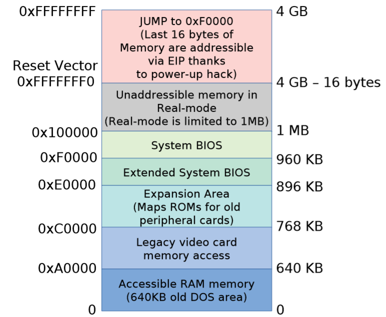
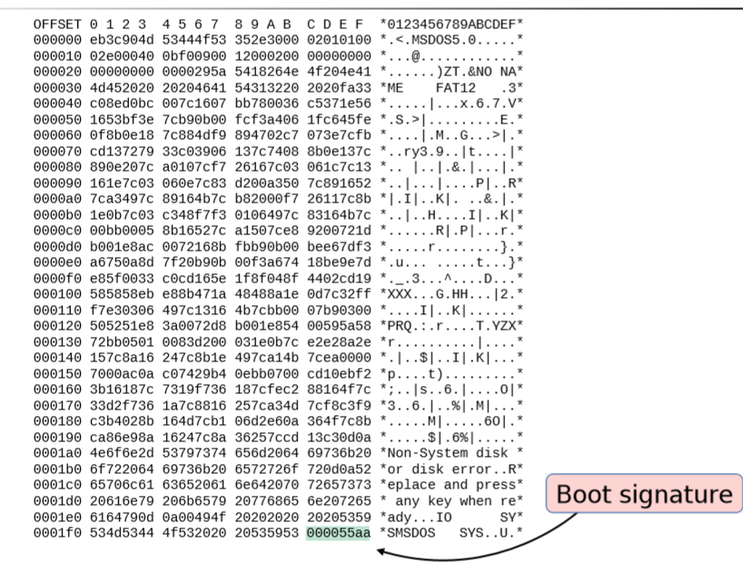
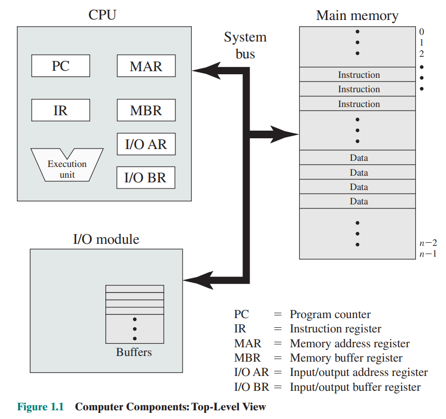
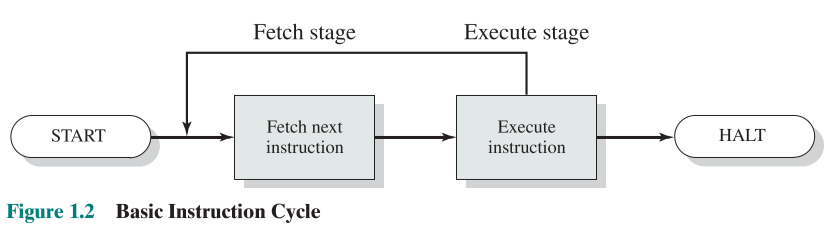
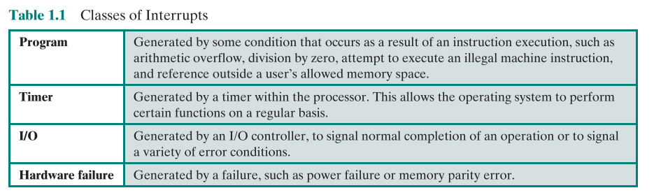
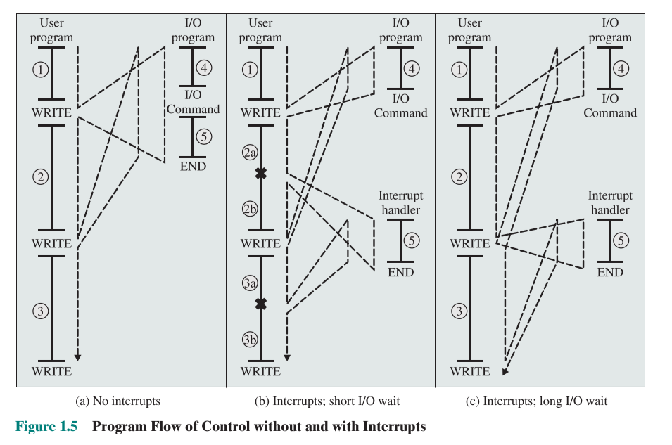

# 第一章 计算机系统概述

内容提要
1. 操作系统及其启动过程 操作系统及其启动过程
2. 计算机基本构成 Basic Elements
3. 基本指令周期 Basic Instruction Cycle
4. 引入中断机制后的指令周期 Instruction Cycle with Interrupts

## 操作系统及其启动过程

操作系统（Operating System，简称OS）是管理和控制计算机硬件与软件资源的计算机程序，是直接运行在“裸机”上的最基本的系统软件，任何其他软件都必须在操作系统的支持下才能运行。

**简单的启动过程概述：**
我们都知道程序的执行是必须要进去内存之后进行执行，操作系统也可以看作一个程序的运行，如果从开机加载到内存中执行的过程就是系统的启动。 

在计算机开机时，boot被自动执行，指引CPU把操作系统从大容量存储器（外存）中传送到主存储器的易失区（内存）。一旦操作系统放到了主存储器中，boot要求CPU执行一条转移指令，转到这个存储区域，在这个时候，操作系统接管并且开始控制整个机器的活动。

**更为详细的启动过程Booting Procedure描述（待更）：**

1. An IA–32-based computer is expected to have a **BIOS** (Basic Input/Output System, which comprises the bootloader firmware) in **non-volatile memory, typically ROM**.
    - BIOS is firmware used to perform **hardware initialization** during the booting process (power-on startup), and to provide runtime services for operating systems and programs.
    - The BIOS is a descendent of the BIOS found on early CP/M systems in that it contains low-level functions for accessing some **basic system devices**, such as performing disk I/O, reading from the keyboard, and accessing the video display. It also contains code to load a **stage 1 boot loader**.

2. When the **CPU** is reset at startup, the computer starts execution at memory location **0xFFFF0** (the IA–32 architecture uses a segment: offset form of addressing; the code segment is set to 0xF000 and the instruction pointer is set to 0xFFF0) **(CS : IP=0xF000:0xFFF0)**.

3. The processor starts up in **real mode**, which gives it access to only a **20-bit memory address space** and provides it with direct access to I/O, interrupts, and memory.
    - **The location at 0xFFFF0 is actually at the end of the BIOS ROM and contains a jump instruction to a region of the BIOS that contains start-up code.**
    - 注意，这时候BIOS已经装入内存了，CPU指向内存的0xFFFF0,也就是如图System BIOS这个区域，这里装着一条跳转指令，跳到BIOS程序的入口点。因为有的BIOS的程序大小不一样，所以有Extended System BIOS这个区域。

4.	Upon start-up, the BIOS goes through the following sequence:

    1. Power-on self-test (POST). 上电自检。
    2. Detect the video card’s (chip’s) BIOS and execute its code to initialize the video hardware.
    3. Detect any other device BIOSes and invoke their initialize functions.
    4. Display the BIOS start-up screen.
    5. **Perform a brief memory test (identify how much memory is in the system). 内存检测。**
    6. Set memory and drive parameters.
    7. Configure Plug & Play devices (traditionally PCI bus devices).
    8. Assign resources (DMA channels & IRQs).
    9. Identify the boot device.

5. When the BIOS identifies the boot device (typically one of several disks that has been tagged as the bootable disk), it reads **block 0** from that device into memory location **0x7c00** and jumps there.

**Stage 1: Master Boot Record**

This first disk block, block 0, is called the **Master Boot Record (MBR)** and contains the first stage boot loader. Since the standard block size is 512 bytes, the entire boot loader has to fit into this space. The contents of the MBR are:
- First stage boot loader (≤ 446 bytes)
- Disk partition table, which identifies distinct regions of the disk (16 bytes per partition × 4 partitions = 64 bytes)
- Disk signature (2 bytes) 0x55AA

**Stage 2: Volume Boot Record**

Once the BIOS **transfers control to the start of the MBR that was loaded into memory**, the MBR code scans through its partition table and loads the Volume Boot Record (VBR) for that partition. The VBR is a sequence of consecutive blocks starting at the first disk block of the designated partition. The first block of the VBR identifies the partition type and size and contains an Initial Program Loader (IPL), which is code that will load the additional blocks that comprise the second stage boot loader. On Windows NT-derived systems (e.g., Windows Server 2012, Windows 8), the IPL loads a program called NTLDR, **which then loads the operating system**.

## 操作系统基本组成 Basic elements at top level

- **Processor**
- **Main memory**
- **IO modules**
- **System bus**

### 基本指令周期 Basic Instruction Cycle

一个程序包含了多条指令，这些指令都存在内存中。处理器会从内存中取一条指令然后执行该指令，这个过程叫一个**指令周期 Instruction Cycle.** 如图所示。

一个指令周期分为fetch stage取指令和execute stage执行指令两个阶段。
- 在取指令阶段，程序计数器Program counter (PC) 会保存下一个需要被取得指令的地址，每次取完指令，这个寄存器都会自增。
- 被取的指令会放在指令寄存器Instruction Register (IR)中。

处理器会根据IR中的指令，来决定做什么，通常会有这一下四种行为：
- **Processor-memory**: 数据可能需要在处理器和内存之间转移。
- **Processor-IO**: 数据可能需要在处理器和IO设备之间转移。
- **Data processing**: 处理器需要进行算术或逻辑运算。
- **Control**: An instruction may specify that the sequence of execution be altered. 例如，处理器从地址为149的存储单元中取出指令，该指令指定下一条指令应该从地址为182的存储单元中取，这样处理器要把程序计数器设置为182.因此，在下一个取指令阶段，将从地址为182的存储单元取指令。

## 中断 Interrupts
几乎所有计算机都提供了中断机制：IO设备和内存可以打断处理器的正常执行指令的顺序。下表提供了中断的种类。

**大概讲讲硬件中断与软件中断。**
1. 硬件中断包括IO中断和时钟中断，都是由硬件设备发给处理器的中断信号。
2. 软件中断包括了程序运行时候会产生的中断，例如算术溢出，除零操作，企图访问非法内存空间，执行一条没有权限的机器码；软件也可以主动发出中断，例如INT 80H,中断号80H，然后就会去执行相应的中断处理服务。

**为什么我们要有中断机制呢**？通常IO设备的速度都远低于处理器，例如打印机，处理器往打印机的缓存区写数据，当数据写满这个区域的时候，我们就不能再写了，必须要等打印机把缓冲区的内容处理了一部分，处理器才可以向打印机缓冲区继续写入数据。处理器这一等，就浪费了很多时间。因此，中断机制是用于提高处理器利用率的。

**简单讲讲处理器跟IO设备是如何通信的。** IO模块（例如磁盘控制器）可以直接与处理器交换数据。某些情况下（例如Direct Memory Access, DMA）允许IO模块直接与内存进行数据交换，从而减轻处理器的负担。

介绍一下**一个IO program都会进行什么动作：**
1. 一连串的指令（如下图label 4）来准备一个IO操作。例如，这个IO操作是以什么模式进行，可能就需要**给IO设备写一些参数**，另外，可能涉及到跟IO设备**交换数据**。
2. The actual **IO command**. 在不使用中断的情况下，这个命令一旦发出，程序就必须等待IO设备去执行相应操作(or periodically check the status, or poll the IO device).The program might wait by simply repeatedly performing **a test operation to determine if the IO operation is done**.
3. A sequence of instructions. labeled 5 in the figure, to complete the operation. This may include **setting a flag indicating the success or failure of the operation**.

- 看Figure 1.5 (a), 如果让程序一直等IO设备完成操作，会浪费相当多的时间。
- 看Figure 1.5 (b), 
