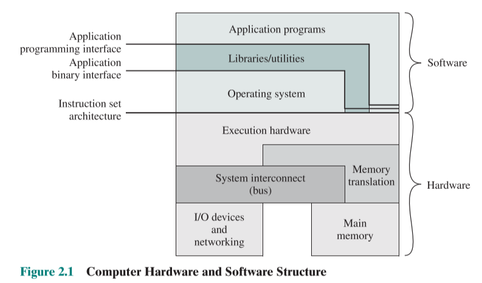
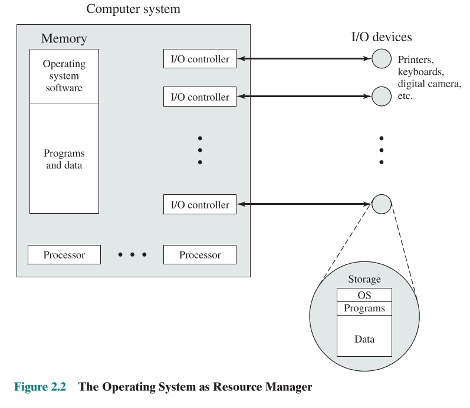

# Operating System Overview

1. Operating System Objectives and Functions
2. Major Achievements

## Operating System Objectives and Functions

- **Convenience**: An OS makes a computer more convenient to use.
- **Efficiency**: An OS allows the computer system resources to be used in an efficient manner. 
- **Ability to evolve**: An OS should be constructed in such a way as to permit the effective development, testing and introduction of new system functions without interfering with service.

我们分别来考察这三个方面。

### The Operating System as a User/Computer Interface

### The Operating System as Resource Manager

### Ease of Evolution of an Operating System

A major OS will evolve over time for a number of reasons:
- Hardware upgrades plus new types of hardware.
- New services: For example, if it is found to be difficult to maintain good performance for users with existing tools, new measurement and control tools may be added to the OS.
- Fixes: Any OS has faults. There are discovered over the course of time and fixes are made. Of course, the fix may introduce new faults.

## Major Achievements

- Process
    - Improper synchronization.
    - Failed mutual exclusion.
    - Nondeterminate program operation.
    - Deadlocks.
- Memory management
    - Process isolation.
    - Automatic allocation and management.
    - Support of modular programming.
    - Protection and access control.
    - Long-term storage.
- Information protection and security
    - Availability.
    - Confidentiality.
    - Data integrity.
    - Authenticity.
- Scheduling and resource management
    - Fairness.
    - Differential responsiveness.
    - Efficiency.

